## Requirements

| Name | Version |
|------|---------|
|  [terraform](#requirement\_terraform) | >= 1.0.0 |
|  [azurerm](#requirement\_azurerm) | 4.8.0 |

## Providers

No providers.

## Modules

| Name | Source | Version |
|------|--------|---------|
|  [aks](#module\_aks) | ./modules/aks | n/a |
|  [log\_analytics](#module\_log\_analytics) | ./modules/log_analytics | n/a |
|  [network](#module\_network) | ./modules/network | n/a |
|  [rg](#module\_rg) | ./modules/rg | n/a |

## Resources

No resources.

## Inputs

| Name | Description | Type | Default | Required |
|------|-------------|------|---------|:--------:|
|  [address\_space](#input\_address\_space) | Address space da VNet | `list(string)` | n/a | yes |
|  [dns\_service\_ip](#input\_dns\_service\_ip) | IP do serviço DNS do Kubernetes | `string` | n/a | yes |
|  [dns\_zone\_name](#input\_dns\_zone\_name) | Nome da zona DNS privada | `string` | n/a | yes |
|  [docker\_bridge\_cidr](#input\_docker\_bridge\_cidr) | CIDR para docker bridge | `string` | n/a | yes |
|  [environment](#input\_environment) | Ambiente (dev, staging, prod) | `string` | n/a | yes |
|  [internal\_subnet\_prefix](#input\_internal\_subnet\_prefix) | CIDR da subnet interna | `string` | n/a | yes |
|  [kubernetes\_version](#input\_kubernetes\_version) | Versão do Kubernetes | `string` | n/a | yes |
|  [location](#input\_location) | Localização dos recursos | `string` | n/a | yes |
|  [location\_short](#input\_location\_short) | Abreviação da localização | `string` | n/a | yes |
|  [mgmt\_subnet\_prefix](#input\_mgmt\_subnet\_prefix) | CIDR da subnet de gerenciamento | `string` | n/a | yes |
|  [resource\_group\_name](#input\_resource\_group\_name) | Nome do Resource Group | `string` | n/a | yes |
|  [retention\_in\_days](#input\_retention\_in\_days) | Dias de retenção dos logs | `number` | `30` | no |
|  [service\_cidr](#input\_service\_cidr) | CIDR para serviços do Kubernetes | `string` | n/a | yes |
|  [shared\_subnet\_prefix](#input\_shared\_subnet\_prefix) | CIDR da subnet compartilhada | `string` | n/a | yes |
|  [system\_node\_pool\_max\_count](#input\_system\_node\_pool\_max\_count) | Número máximo de nodes no system pool | `number` | n/a | yes |
|  [system\_node\_pool\_min\_count](#input\_system\_node\_pool\_min\_count) | Número mínimo de nodes no system pool | `number` | n/a | yes |
|  [system\_node\_pool\_vm\_size](#input\_system\_node\_pool\_vm\_size) | Tamanho das VMs do system node pool | `string` | n/a | yes |
|  [tags](#input\_tags) | Tags para os recursos | `map(string)` | `{}` | no |
|  [user\_node\_pool\_max\_count](#input\_user\_node\_pool\_max\_count) | Número máximo de nodes no user pool | `number` | n/a | yes |
|  [user\_node\_pool\_min\_count](#input\_user\_node\_pool\_min\_count) | Número mínimo de nodes no user pool | `number` | n/a | yes |
|  [user\_node\_pool\_vm\_size](#input\_user\_node\_pool\_vm\_size) | Tamanho das VMs do user node pool | `string` | n/a | yes |
|  [vnet\_name](#input\_vnet\_name) | Nome da Virtual Network | `string` | n/a | yes |
|  [workload](#input\_workload) | Nome do workload/projeto | `string` | n/a | yes |

## Outputs

| Name | Description |
|------|-------------|
|  [aks\_cluster\_name](#output\_aks\_cluster\_name) | Nome do Cluster AKS |
|  [aks\_node\_resource\_group](#output\_aks\_node\_resource\_group) | Resource Group dos Nodes do AKS |
|  [log\_analytics\_workspace\_name](#output\_log\_analytics\_workspace\_name) | Nome do Workspace do Log Analytics |
|  [resource\_group\_location](#output\_resource\_group\_location) | Resource Group Location |
|  [resource\_group\_name](#output\_resource\_group\_name) | Resource Group Name |
|  [vnet\_name](#output\_vnet\_name) | Nome da Virtual Network |

## Diagrama de Infraestrutura

O diagrama abaixo representa a infraestrutura atual do projeto:

```mermaid
graph TD
    module.aks.azurerm_kubernetes_cluster.aks[azurerm_kubernetes_cluster]
    module.aks.azurerm_kubernetes_cluster_node_pool.user[azurerm_kubernetes_cluster_node_pool]
    module.log_analytics.azurerm_log_analytics_solution.solution[azurerm_log_analytics_solution]
    module.log_analytics.azurerm_log_analytics_workspace.workspace[azurerm_log_analytics_workspace]
    module.network.azurerm_private_dns_zone.dns[azurerm_private_dns_zone]
    module.network.azurerm_private_dns_zone_virtual_network_link.dns_link[azurerm_private_dns_zone_virtual_network_link]
    module.network.azurerm_subnet.internal[azurerm_subnet]
    module.network.azurerm_subnet.mgmt[azurerm_subnet]
    module.network.azurerm_subnet.shared[azurerm_subnet]
    module.network.azurerm_virtual_network.vnet[azurerm_virtual_network]
    module.rg.azurerm_resource_group.rg[azurerm_resource_group]

```

